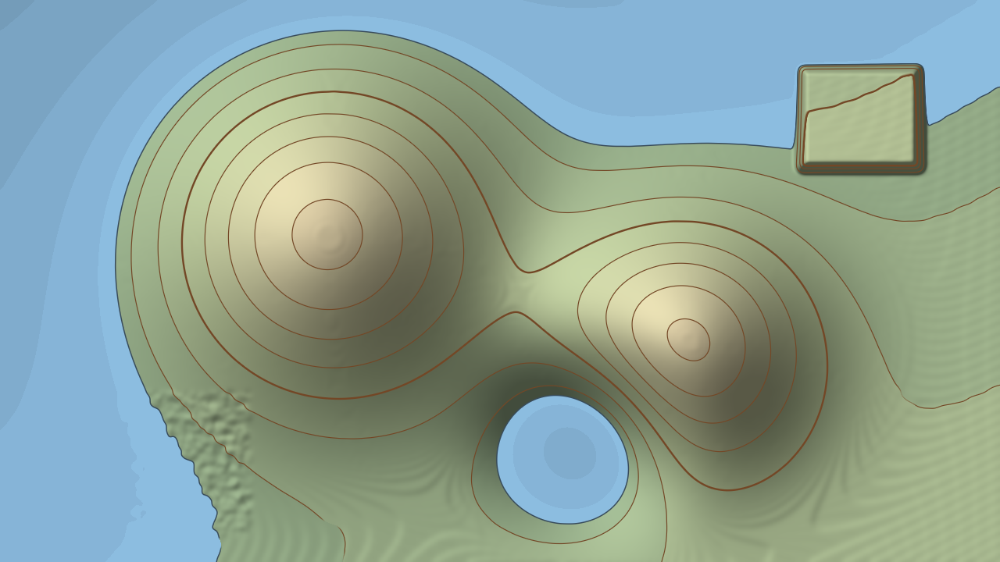

# Contour user guide

Contour is **a survey map of your clip for [Resolume](https://resolume.com) Arena and Avenue**,
as an FFGL effect. It reads the picture's brightness as the height of the ground and draws that
ground the way a cartographer would: contour lines at a fixed interval with every Nth one
heavier, hill-shading from the north-west, colour bands by elevation, and a sea over the low
ground that the music can raise. Nothing is drawn on purpose. The lines crowd where the picture
changes fast and open out where it changes slowly, because that is what contours do.



*The harness's moving terrain card through the plugin at its default settings with Sea Level
raised from 0.05 to 0.2, rendered by the offline harness rather than captured from Resolume. The
card also carries its own synthetic bass pulse, which lifts the sea further into the valleys and
turns the hollow into a lake.*

> **Before you rely on this:** released at **v0.1.0**, and honestly early. The map is measured
> rather than asserted, by a harness that drives the real plugin class and reads each claim back
> out of the picture, at two resolutions: five brightness ramps cross **exactly** the stated
> number of contours, from 20 to 150; lines 8, 12 and 16 px apart land exactly where the slope
> puts them, and fractional spacings within the pixel grid's own bound; on ground whose slope
> spans **8:1**, every one of 40 and 175 contours is drawn 1.20 px wide, or 2.40 for an index
> contour, each within a bound worked out for that stroke; ten planes of known slope shade to
> the cartographer's hill-shading formula to within 6.4e-5; **0** of 57,600 and 921,600 pixels
> are on the wrong side of the waterline; a noisy plateau lying exactly on a contour level draws
> no ink at all;
> and sixteen deliberately broken versions of the model each fail the check built for them.
> All 30 controls are shown to change the picture. It has **never been loaded into Resolume on
> macOS** — the one host it has run in is the fleet's own test host, `oxbow`, for 120 frames.
> On Windows, a build of v0.1.0 loads, registers and renders in Resolume Arena 7.27.1, with every control matching what the plugin declares — on software rendering, so that says nothing about a GPU. The four audio controls could not be tested there, because that machine has no sound device; every other control was shown moving the picture.
> Try it on a spare layer before you put it in a show.
>
> This codebase was created with AI assistance, directed and reviewed by a human author.

---

## Installing

Every download carries one effect, **SW Contour**. Drop it into Resolume's effects folder and
restart Resolume:

```
macOS    ~/Documents/Resolume Arena/Extra Effects/
Windows  %USERPROFILE%\Documents\Resolume Arena\Extra Effects\
```

Avenue uses the same layout under its own folder name. The effect then appears in the effects
browser as **SW Contour**.

The macOS download is a universal build (Apple silicon and Intel), as a `.dmg` or a `.zip`. It is
**Developer ID-signed and notarised**, so the bundle simply loads. The
Windows download is an x64 installer or a `.zip`. It is not code-signed, so the installer trips
SmartScreen once: **More info** → **Run anyway**.

---

## The picture is the ground

Imagine every pixel of your clip as a spot on a landscape, and its brightness as how high that
spot is. Black is the lowest ground there is, white the highest. Now survey it:

- **A contour is a line of equal height.** Walk along one and you never go up or down. Contour
  draws one every **Interval** of height, so a bright blob in the middle of a dark frame becomes
  a hill ringed by lines.
- **Where the brightness changes fast, the lines crowd together.** A hard edge in the picture is
  a cliff, and a cliff has its contours stacked on top of each other. A soft gradient is a gentle
  slope with its contours far apart. Nothing places the lines; their spacing *is* the slope.
- **Every line is the same pen width**, on a cliff and on a plain. Each line is drawn from how far
  each pixel is from it *on the screen*, not from how different its height is, so a line on a
  steep face is not a hairline and a line on a gentle one is not a smear.
- **The sea is everything below a height.** Its shore is simply the contour at sea level, so when
  the sea rises it pours into the low ground first — the dark parts of the picture — and leaves
  the bright parts standing as islands.

Two consequences are worth knowing before you start. **Noise makes an unreadable map**: grain,
compression and fine texture are all tiny hills, each with its own ring of contours. A surveyor
smooths the ground before contouring it, and so does **Smooth**. And **flat ground has no
contour**: where the picture barely changes, the line's position would be decided by noise and
8-bit steps rather than by the picture, so lines fade out there instead of scribbling across a
sky or a wall.

The ground is only the brightness. A bright shirt is a hill whether or not it is in front of
anything.

---

## Start here

Put SW Contour on a layer with **something that has big, soft shapes in it** — a face, clouds, a
slow gradient, smoke — and leave every control alone. The defaults are a survey sheet: brown
contours about every twentieth of the brightness range with every fifth one heavier, a
hill-shade lit from the upper left, green-to-snow tints on cream paper, and a pale blue sea over
the darkest fifth of the picture.

Then:

1. **Too many lines, too busy?** Raise **Smooth**. Noise and grain become rolling ground and the
   contours settle into long curves. Raise **Interval** for fewer lines.
2. **Not enough lines on soft gradients?** Also **Smooth**. Smoothing lets gentler ground carry
   a contour (see the Terrain group), so a sky that draws nothing at the default may draw at a
   higher setting.
3. **A sea that moves with the music.** In the **Audio** group, pick a source on the **Audio**
   input — Resolume's own audio-source picker — and play something with a kick. The defaults
   are **Audio Mode** on **Onset** and **Audio Band** on **Bass**: each kick surges the sea up
   into the valleys and lets it drain away over a fraction of a second. **Audio Rise** sets how
   far a surge goes. Switch Audio Mode to **Level** for a sea that breathes with the loudness
   instead, and try **Full Range** on Audio Band.
4. **A plain line drawing.** **Tint Mode → Off**, **Hillshade → 0**, **Sea Level → 0** and
   **Audio Rise → 0**: brown contours on cream paper and nothing else. Change **Line Colour**
   and **Paper Colour** for white on blueprint blue.
5. **A shaded relief with no lines.** **Contours On** off. The hill-shade and the colour bands
   carry the shape on their own.
6. **Over the clip.** Bring **Mix** down to lay the map over the picture it was made from.

---

## Time, and the only thing that remembers

The map is worked out afresh from every frame. The same frame always draws the same map, and
nothing about the lines, the shading or the tints depends on what came before.

**The sea's audio drive is the one exception.** Its releases and its onset baseline are timed in
seconds from Resolume's clock, not counted in frames, so a surge drains at the same speed at 30
fps and at 60. The first frame the effect renders, and the first frame after the clock jumps —
it goes backwards, or more than half a second passes between two frames, as in a scrub or a
stall — is taken as the starting point rather than as a hit, so loading the effect with music
already playing does not flood the map. A change of composition resolution leaves the drive
alone.

---

## The Terrain group

How the picture becomes ground.

**Height Source** — which part of the picture is the height: **Luma** (the default, Rec. 709
brightness), **Red**, **Green**, **Blue** or **Alpha**. A single channel turns one colour into
the hills: Red makes a red sweater a mountain and a blue sky a plain. Alpha turns a keyed or
masked layer into a plateau with cliffs at its edge.

**Height Scale** — how high white is, 0 to 2; **1 at the middle of the slider**, the default.
Sea Level, the colour bands and the Audio Rise are all set as fractions of this range, so they
stay put when you move it. What changes is the ground's steepness against a fixed Interval:
at 2 there are twice as many contours and the hill-shade is steeper; towards 0 the contours and
the relief thin out, and at 0 the ground is dead flat.

**Invert** — off by default. Dark becomes high and bright becomes low. The sea then fills the
bright parts of the picture.

**Smooth** — the surveyor's generalising, a Gaussian blur of the height before anything is
drawn: **0 to 16 pixels** of blur, on a slider that rises slowly at first (a quarter of the way
is 1 px, half way is 4 px, three quarters is 9 px). Default **4 px**, half way. At 0 every
speck of grain gets its own contour. Up at 16 px only the big shapes survive, and the contours
become long, slow curves.

The blur is in **pixels of the picture**, not a fraction of the frame, so the same setting
generalises a 4K clip far less than a 720p one: a 4K layer needs roughly three times the blur to
look like the same map at 720p.

Smooth also decides how gentle a slope can be and still carry a line. Below about one 8-bit
brightness step over eight pixels, a line's position is decided by noise and 8-bit steps rather
than by the picture, and lines fade out; Smooth divides that limit by its size in pixels, so at
the default of 4 px, lines begin to appear on ground rising one step over 32 px and are fully
drawn from one step over 16 px up. Smooth is in pixels, so the
same clip in a 4K composition has gentler slopes per pixel than it does at 1080p, and needs more
Smooth to carry the same lines.

---

## The Contours group

**Interval** — how much height lies between one contour and the next. The slider rises slowly
at first: **half way is 1/16 of the range** (16 lines from black to white at Height Scale 1),
and the top is a quarter (four lines). The default, 0.45, is about 1/20, which gives around
twenty. At the very bottom it stops at 1/512 of the range, where the lines merge into solid
ink on anything that is not flat.

**Index Every** — **2 to 10**, default **5**. Every this many contours is an index contour,
drawn heavier, as on a survey sheet. They are counted from height zero, not from the sea, so
moving the sea does not renumber them, just as it would not on a real map.

**Line Width** — the ordinary contours' pen, **0 to 4 pixels**; default **1.2 px**. It is a
width on the screen, so it is the same on a cliff and a plain and the same at any resolution.
At 0 only the index contours are left.

**Index Width** — the index contours' pen, **0 to 6 pixels**; default **2.4 px**. At 0 the
index contours disappear and leave gaps in the sequence.

**Line Colour** — the colour of both kinds of contour, a warm brown by default. It is declared
to the host as a red, green and blue triple, which appears as **Line Colour**, **Line_Green**
and **Line_Blue**; depending on how Resolume presents them, you will see a colour swatch or
three sliders.

**Contours On** — on by default. Off takes every contour, ordinary and index, off the map. The
shoreline stays; it belongs to the Sea group.

Contours are drawn on land only. Below the sea, the depth is carried by the water's tint, and
there are no depth contours.

---

## The Relief group

Hill-shading: the ground lit by a low sun, so slopes facing it stay bright and slopes facing
away fall into shade.

**Hillshade** — how much, **0 to 1**; default **0.6**. At 0 there is no shading. The shading only
darkens: a slope turned square to the light keeps the full tint, and everything else is darker
than that. Flat ground is darkened too, by how low the sun is — under the default 45° sun, flat
ground at full Hillshade is about 70% of its tint. It shades land only; the sea is not shaded.
At **1**, a slope facing away from the light and steeper than the sun is high (45° at the
default Altitude, before Z Factor) goes fully **black**, so on busy footage full Hillshade turns
much of the map dark; the default 0.6 keeps every slope readable.

**Azimuth** — where the light comes from, as a compass bearing, clockwise from **north, which
is the top of the frame**: 0 is from the top, a quarter of the way along is from the right, half
way from the bottom, three quarters from the left. The default is **315°**, from the upper left,
which is the cartographer's convention: lit from there, most eyes read hills as hills. Swing it
round to the bottom and the relief can read inside out, hills as hollows.

**Altitude** — how high the sun is, **0 to 90°**; default **45°**. At 90° the sun is overhead,
flat ground is at full brightness, and every slope darkens by its steepness whichever way it
faces. Towards 0 the sun grazes the ground: flat land goes dark and only slopes facing the light
stay bright.

**Z Factor** — vertical exaggeration, **0.1 to 10**, on a logarithmic slider with **1 at the
middle**, the default. At 1 and Height Scale 1, a rise from black to white over the frame's
height is a 45° slope. It is measured against the frame's height, so the relief looks the same
at any resolution.
Raise it for dramatic shading on subtle footage; lower it when everything is either bright or
black. It changes the shading only, never where the contours fall.

---

## The Tints group

Colour bands by height, as on a physical map.

**Tint Mode** — **Classic** (the default), **Mono** or **Off**.

| Tint Mode | Land | Sea |
| --- | --- | --- |
| **Classic** | Green at the coast, through pale green, sand and brown, to near white at the top of the range. | Darker the deeper it is, up to 55% darker at full Tint Strength. |
| **Mono** | A grey ramp, darker at the coast and lighter at the top. | As Classic. |
| **Off** | Paper Colour. | Plain Water Colour. |

The land's colours run from **the current sea level** to the top of the range, so the coast is
always the lowest colour: when the sea rises, the colour bands climb the hills with it.

The colour is **banded between contours**: each band from one contour level to the next takes
one flat colour, chosen at its middle height, as layer colouring on a real map does. That holds
with Contours On off too, so the bands follow the Interval whether or not the lines are drawn.

**Tint Strength** — how strongly the tint is laid over the paper, **0 to 1**; default **0.6**.
At 0 the land is plain paper and the sea is plain water. It does nothing with Tint Mode on Off.

---

## The Sea group

**Sea Level** — how high the sea stands, as a fraction of the height range: **0 to 1**; default
**0.05**, the darkest twentieth of the picture. Much higher on dark footage and the sea swallows
the map: at 0.2, 18 of Resolume's 33 bundled demo clips, all the Bass and Synth loops among them,
come out as a nearly solid blue field, which is why the default is this low. Every pixel lower than it is water and every pixel
at or above it is land. At 0 there is no sea; at the top everything but pure white is under
water (with Invert off). The audio's rise is added on top of this.

**Audio Rise** — how far the audio can lift the sea, **0 to 1**; default **0.5**. At full drive
the sea rises by Audio Rise times half the height range: at the default, a full surge lifts it by
a quarter of the range, from 0.05 to 0.3. At 0 the audio does nothing. With no audio routed, the
drive is zero and the sea stays where Sea Level puts it.

**Water Colour** — the sea, pale blue by default. As with Line Colour, the host sees
**Water Colour**, **Water_Green** and **Water_Blue**.

**Shore Width** — the shoreline's pen, **0 to 6 pixels**; default **1.5 px**. The shoreline is the
contour at sea level, drawn in a darker shade of the Water Colour (four tenths of it). It also
hides the edge of the water, which is decided pixel by pixel and would otherwise be a staircase:
**at 0 the coast is aliased**. Like the contours, the shoreline fades out on flat ground.

---

## The Audio group

**Audio** — Resolume's own audio-source picker (Local, Composition or External); it is not a
slider. The plugin asks for 64 bands of the spectrum and Resolume fills them once a frame. This is
what raises the sea, and nothing else.

**Audio Mode** — how the sound becomes a tide:

- **Level** — the sea follows the loudness of the chosen band. It rises at once when the band
  gets louder and falls back with a quarter-second release, so the sea breathes with the music.
- **Onset** — the default. The sea surges on a hit and drains after it. The plugin compares the
  band with a baseline that catches up in about a tenth of a second, so a sudden rise is a hit
  and a sustained level is not; the surge is four times the size of the rise, capped at full, and
  drains with a 0.3 s release. A sustained note holds the surge for a moment, until the baseline
  catches up, then lets it go.

**Audio Band** — which part of the spectrum is listened to: **Full Range**, **Bass** (the
default), **Mid** or **Treble**. Of the 64 bands, Bass is the first 8, Mid the next 20 and
Treble the last 36. Nobody has measured which frequencies Resolume's bands carry, so treat the
names as a low, middle and high share of the spectrum rather than crossover points.

---

## The Output group

**Paper Colour** — the paper the map is printed on, a warm cream by default. It shows wherever
the land is untinted, and under the tints at less than full Tint Strength. The host sees
**Paper Colour**, **Paper_Green** and **Paper_Blue**.

**Mix** — the map against the untouched clip, **0 to 1**; default **1**. The map is opaque, so
at 1 the clip's own alpha is replaced: the output is fully opaque whatever came in. Zero is the
clip as it arrived. In between, the map is laid over the clip.

---

## How it works

Once a frame:

1. **Height.** Each pixel's Height Source is read, inverted if asked, and multiplied by Height
   Scale. That is the ground, one value per pixel, held at full floating-point precision.
2. **Smooth.** A Gaussian blur of Smooth pixels, across then down. At the edge of the frame the
   ground is taken to carry on level. Skipped when Smooth is 0.
3. **Slope.** The ground's slope at each pixel, from its neighbours on either side.
4. **Draw.** For each pixel: the nearest contour level, and how many pixels away that contour is
   on the screen — the height difference divided by the slope. That distance decides how much of
   the pen covers the pixel, exactly as a line of that width drawn over the pixel grid would.
   Where the slope is below the flat-ground limit, the line fades out. Below sea level the pixel
   is water, tinted by depth; above it, it is tinted by height band, hill-shaded, and inked with
   the contour. The shoreline goes over both.
5. **Mix** the map over the clip.

The sea's level is worked out on the CPU from the spectrum before the frame is drawn, and it is
the only thing carried from one frame to the next.

---

## Performance

Measured by the offline harness on an M4 Max, in milliseconds per frame, best of three runs, on
a GPU shared with other work:

| | defaults (Smooth 4 px) | % of a 60 fps frame | Smooth at the top (16 px) |
| --- | --- | --- | --- |
| 1280×720 | 0.11 | 0.7% | 0.32 |
| 1920×1080 | 0.29 | 1.8% | 0.73 |
| 3840×2160 | 1.28 | 7.7% | 2.90 |

**Smooth is the only control that costs anything noticeable**: the blur reaches three times its
size either side, up to 97 samples across and 97 down at the top of the slider. The plugin keeps
up to three picture-sized buffers of single-channel float — about 11 MB at 720p, 25 MB at 1080p
and 100 MB at 4K, by arithmetic rather than measurement. Nothing was timed inside Resolume, and
nothing was timed on Windows.

---

## If it looks wrong

**A scribble of tiny rings everywhere.** The clip is noisy, grainy or compressed, and every
speck is a hill. Raise Smooth.

**Large areas with no lines at all.** The ground there is flatter than the flat-ground limit, so
its lines fade out by design. Raise Smooth, which lowers the limit, or lower Interval. The same
clip carries fewer lines on gentle slopes in a 4K composition than at 1080p.

**The lines are a solid mass of ink.** Interval is near the bottom of its slider, or Height
Scale is high, so there are more contours than pixels to draw them in.

**Everything is water, or there is no water.** Sea Level is high or at 0, or Invert has put the
sea on the bright parts. Remember the audio adds to Sea Level.

**The sea never moves.** Nothing is routed on the **Audio** picker, Audio Rise is at 0, or the
chosen band is quiet: Bass needs a kick. On Onset, a steady sound does not count as a hit; try
Level.

**The sea is always high.** Audio Mode is on Level with a loud source. Lower Audio Rise, or use
Onset.

**The whole map is dark.** Altitude is low, so the sun is grazing the ground, or Hillshade is
high. Or Paper Colour or the tints have been changed.

**The coast has jagged steps.** Shore Width is 0.

**The shading looks inside out, hollows as hills.** Azimuth has put the light at the bottom of
the frame. Put it back at the default, from the upper left.

**The clip's transparency is gone.** The map is opaque at Mix 1. Use Height Source on Alpha to
draw the shape of a keyed layer instead.

**It is slow.** Smooth is high on a 4K composition. See Performance.

**SW Contour is not in the effects browser.** Check the folder under Installing, and that
Resolume was restarted.

**The effect does nothing at all.** A shader that will not compile looks exactly like that, and
the real message is in the log:

```
macOS    ~/Library/Logs/contour/contour.YYYY-MM-DD.log
Windows  %LOCALAPPDATA%\contour\logs\contour.YYYY-MM-DD.log
```

It records when the plugin loaded, the GL vendor, renderer and version, which of the three
shaders failed if one did, a buffer that could not be allocated and at what size, and at frame
60 the host's clock and the unit the plugin has taken it to be in.

---

## Known limits

- **Never loaded into Resolume on macOS**, and nothing has driven the controls in a host. How
  the eight groups, the four dropdowns, Index Every, the colour triples and the audio picker
  present in the inspector is untested.
- **Never seen on real footage.** Every picture so far is synthetic terrain. Whether a face or a
  crowd reads as a landscape, and how much Smooth it needs, is unjudged.
- **The ground is the brightness.** Nothing knows about depth or what is in front of what.
- **Flat ground has no contour.** Below about one 8-bit step over eight pixels (less with
  Smooth), lines fade out, so a very gentle gradient carries no lines until you smooth more.
  That limit is a judgement, argued rather than measured on real footage, and it is per pixel,
  so the same clip carries fewer lines at 4K than at 1080p.
- **The coast is a hard pixel edge** under its shoreline stroke; at Shore Width 0 it is aliased.
- **No depth contours under the sea**, only the tint.
- **Nobody has measured what Resolume's 64 FFT bins carry.** The band split and the way the
  level is read from them are choices, not measurements, and the audio has only ever been tested
  with synthetic spectra. Onset reacts to the size of a rise, not its size relative to the
  track, so a quiet track and a loud one surge differently at the same Audio Rise.
- **Not checked at 4K**, only timed there.
- **The output is opaque**; the clip's alpha does not pass through at Mix 1.
- **Never run on Intel**, although the macOS build contains an Intel slice.
- **No presets** and no OpenFX version.
- **There is a browser demo** at [contour-demo.stoatworks-labs.com](https://contour-demo.stoatworks-labs.com).
  It is a port to a web page, not the plugin: the shaders run in WebGL2 and any CPU
  half is rewritten in JavaScript. The page lists what it does not reproduce.

---

## About

The last group, **About**, carries the plugin's name, version, licence and maker, and buttons
that open this user guide, the project page, the source on GitHub and the support page in your
browser. The guide is at
[stoatworks-labs.com/software/contour/guide/](https://stoatworks-labs.com/software/contour/guide/).

## Reporting something

[github.com/stoatworks-labs/contour/issues](https://github.com/stoatworks-labs/contour/issues).
A screenshot, the Height Source, Smooth, Interval and Sea Level settings, what is routed on the
Audio picker, and the composition's resolution and frame rate are usually enough. If the effect
did nothing, attach the log.
